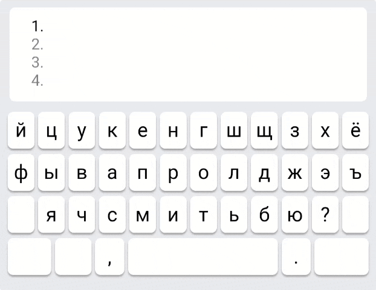

# Neural glide typing

A transformer neural network for a gesture keyboard that transduces curves swiped across a keyboard into word candidates

Contribution:
* **A new method for constructing swipe point embeddings (SPE) that outperforms existing ones.** It leverages a weighted sum of all keyboard key embeddings, resulting in a notable perfomance boost: **0.67% increase in Swipe MRR and 0.73% in accuracy** compared to SPE construction methods described in literature

Other highlights:
* **Enhanced Inference with Custom Beam Search**: a modified beam search is implemented that masks out logits corresponding to impossible (according to dictionary) token continuations given an already generated prefix. It is faster and more accurate than a standard beam search

*This repository used to contain my Yandex Cup 2023 solution (7th place), but after many improvements, it has become a standalone project*

## Demo

Try out a live demo with a trained model from the competition through this [web app](https://proshian.pythonanywhere.com/)


> [!Note]
> If the website is not available, you can run the demo yourself by following the instructions in [the web app's GitHub repository](https://github.com/proshian/neuroswipe_inference_web).

> [!Note]
> The website may take a minute to load, as it is not yet fully optimized. If you encounter a "Something went wrong" page, try refreshing the page. This usually resolves the issue.

> [!NOTE]  
> The model is an old and underfit legacy transformer variation (m1_bigger in models.py) that was used in the competition. A significant update is planned for both this project and the web app, but it will happen in winter 2024 

## Report

**Access a brief research report [here](docs_and_assets/report/report.md)**, which includes:

* Overview of existing research
* Description of the developed method for constructing swipe point embeddings
* Comparative analysis and results

For in-depth insights, you can refer to my [master's thesis](https://drive.google.com/file/d/1ad9zlfgfy6kOA-41GxjUQIzr8cWuaqxL/view?usp=sharing) (in Russian)


## Prerequisites

Install the dependencies:

```sh
pip install -r requirements.txt
```

* The inference was tested with python 3.10
* The training was conducted in kaggle using Tesla P100


## Yandex Cup Dataset: Obtaining and Preparation

To acquire and prepare the Yandex Cup dataset, follow the steps below:

### Option 1: Obtain and Preprocess the Dataset from Scratch

```sh
cd src
bash ./data_obtaining_and_preprocessing/obtain_and_prepare_data.sh
```

> [!Note]  
> The pipeline takes approximately **7 hours** to complete on the tested machine.


### Option 2: Download the Preprocessed Dataset (Recommended)

If you prefer to skip the lengthy preprocessing steps, you can directly download the preprocessed dataset:

```sh
cd src
python ./data_obtaining_and_preprocessing/download_dataset_preprocessed.py
```


## Workflow Overview

A trained model is defined not only by its class and weights but also by the dataset transformation used during training.


All current models are instances of `model.EncoderDecoderTransformerLike` and consist of the following components:
* Swipe point embedder
* Word component token embedder (currently char-level)
* Encoder
* Decoder 

Transforms extract features from the raw dataset, converting each dataset item from the format `(x, y, t, grid_name, tgt_word)` to `(encoder_input, decoder_input), decoder_output`.

After collating the dataset, the format becomes `(packed_model_in, dec_out)`, where `packed_model_in` is `(encoder_input, decoder_input, swipe_pad_mask, word_pad_mask)`. `packed_model_in` is passed to the model via unpacking (`model(*packed_model_in)`).

* `encoder_input` is passed as the only argument to swipe_point_embedder’s forward. The type depends on which swipe point embedding layer you use. It can be a single object, a tuple of objects
* `decoder_input` and `decoder_output` are `tokenized_target_word[1:]` and `tokenized_target_word[:-1]` correspondingly.


A trained swipe decoding method is defined by
* model class
* model weights
* dataset transformation
* decoding algorithm


## Your Custom Dataset

Your custom dataset must have items of format: `tuple(x, y, t, grid_name, tgt_word)`. These raw features won't be used but there are transforms defined in `feature_extractors.py` corresponding to every type of `swipe point embedding layer` that extract the needed features. You can apply these transforms in your dataset's `__init__` method or in `__get_item__` / `__iter__`. The data formats after transform and after collation are described above

You also need to add your keyboard layout to `grid_name_to_grid.json`

<!--

**TODO: Add info on how exactly the dataset should be integrated** 

-->

## Training

<!-- Перед побучением необходимо очистить тренировочный датасет -->

The training is done in [train.ipynb](src/train.ipynb)

> [!WARNING]  
> `train.ipynb` drains RAM when using `n_workers` > 0 in Dataloader. This can result in up to `dataset_size * n_workers` extra gigabytes of RAM usage. This is a known issue (see [here](https://github.com/pytorch/pytorch/issues/13246)) that happens when a dataset uses a list to store data. Although `torch.cuda.empty_cache()` can be used as a workaround, it doesn't seem to work with pytorch lightning. It appears I didn't commit this workaround, but you can adapt train.ipynb from [before-lightning branch](https://github.com/proshian/neuroswipe/tree/before-lightning) by adding ```torch.cuda.empty_cache()``` after each epoch to to avoid the issue. When training in a kaggle notebook, the issue is not a problem since a kaggle session comes with 30 Gb of RAM.  


## Prediction

[word_generation_demo.ipynb](src/word_generation_demo.ipynb) serves as an example on how to predict via a trained model.

[predict_v2.py](src/predict_v2.py) is used to obtain word candidates for a whole dataset and pickle them

> [!WARNING]  
> If the decoding algorithm in `predict_v2.py` script utilizes a vocabulary for masking (if `use_vocab_for_generation: true` in the config), it is necessary to disable multiprocessing by passing the command-line argument `--num-workers 0` to the script. Otherwise, the prediction will take a long time. It's a bug that will be fixed


## Yandex cup 2023 results
* [task](./docs_and_assets/yandex_cup/task/task.md)
* [submission reproduction](./docs_and_assets/yandex_cup/submission_reproduciton_instrucitons.md). 
* [leaderboard](./docs_and_assets/yandex_cup/leaderboard.md)


# Documentation
A WIP documentation can be found [here](./docs_and_assets/documentation.md). It doesn't contain much information yet, will be updated. Please refer to docstrings in the code for now


## Thank you for your attention


## For future me
See [refactoring plan](./docs_and_assets/Refactoring_plan.md)