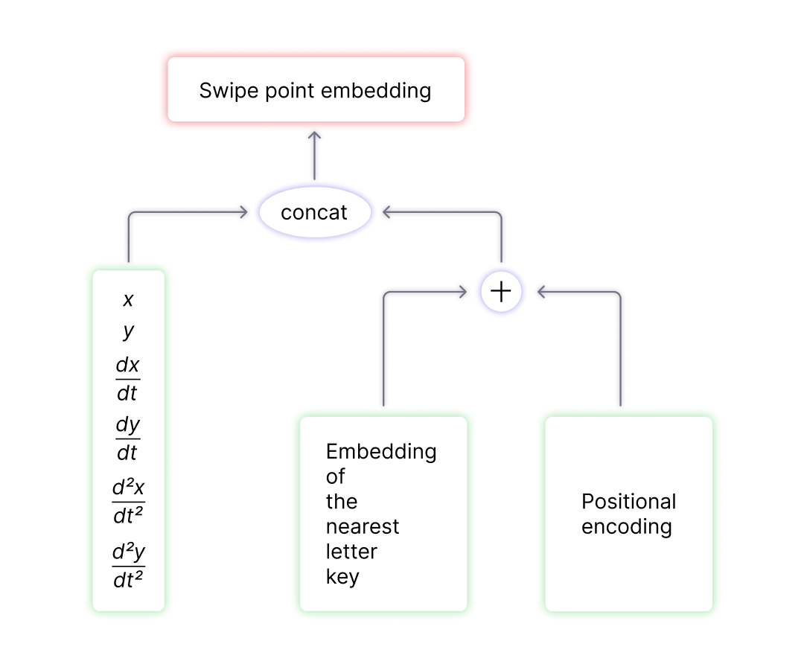

# NeuroSwipe

Transformer model that is used for a gesture keyboard (performs recognition of curves that are swiped across a keyboard on a smartphone display)

The repository is my yandex cup 2023 solution (7-th place) with improvements

## Demo

You can try out one of the models trained as part of the competition in a [web app](https://proshian.pythonanywhere.com/)

## Method

The model is encoder-decoder transformer.
The first tranformer encoder layer can input a sequence with elements of a dimension different from other encoder layers.

Encoder input sequence consists of elements denoted as `swipe point embedding` on the image below.

The $\frac{dx}{dt}$, $\frac{dy}{dt}$, $\frac{d^2x}{dt^2}$, $\frac{d^2y}{dt^2}$ derivatives are calculated using finite difference method.

Decoder input sequence consists of character-level embeddings (with positional encoding) of the target word.

Keyboard key embeddings used in encoder and charracter embeddings used in decoder are different entities.

More info in [solution_description.md](solution_description.md) file (in Russian).

## Competition submission reprodction instructions
Competition submission reprodction instructions are [here: submission_reproduciton_instrucitons.md](submission_reproduciton_instrucitons.md)

## Training
The training is in [src/train.ipynb notebook](src/train.ipynb)

<!-- Перед побучением необходимо очистить тренировочный датасет -->

## Future work

## For future me
See refactoring plan [here](./Refactoring_plan.md)